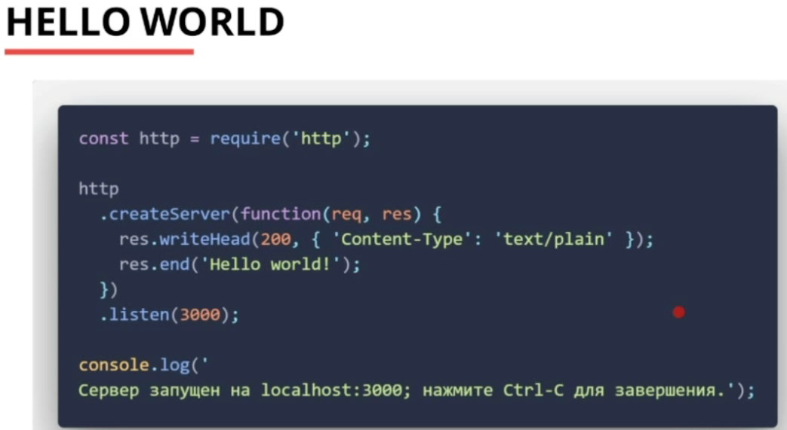
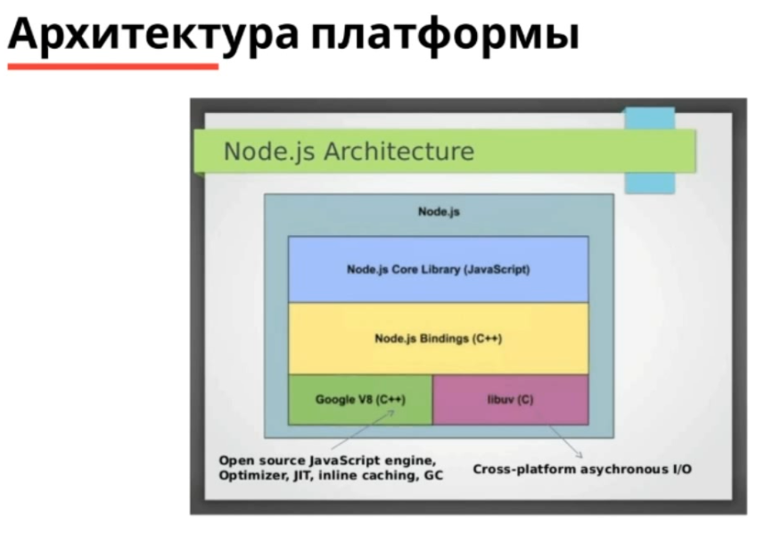
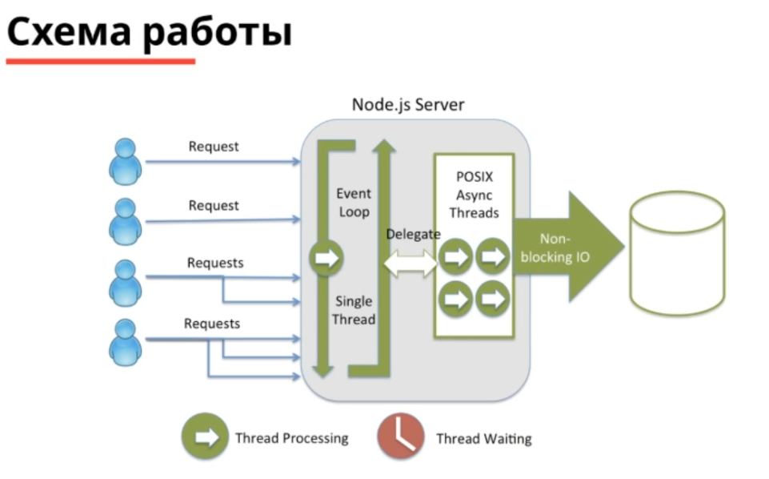
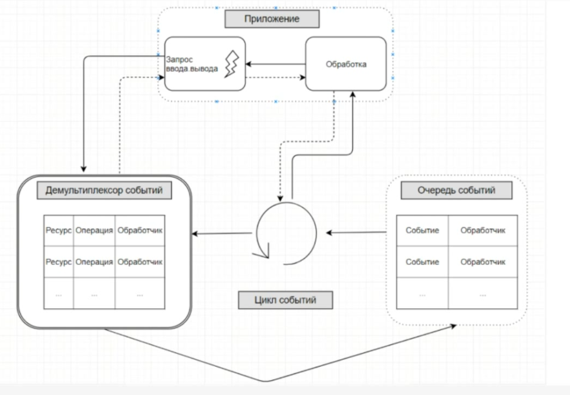
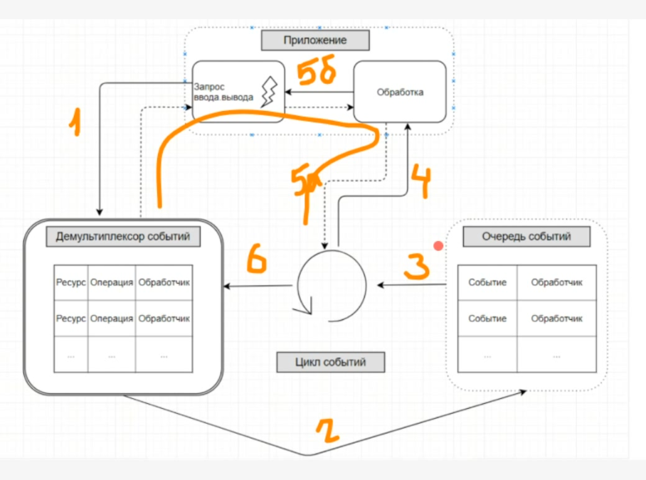
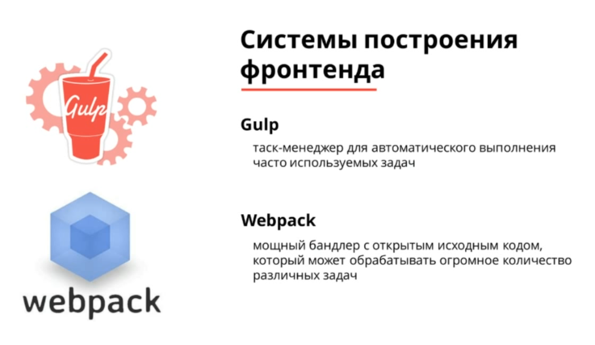
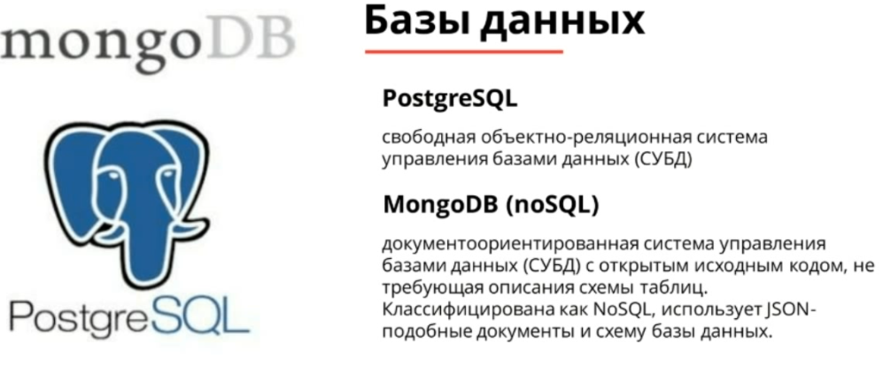
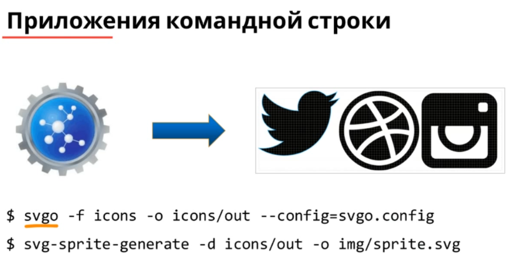
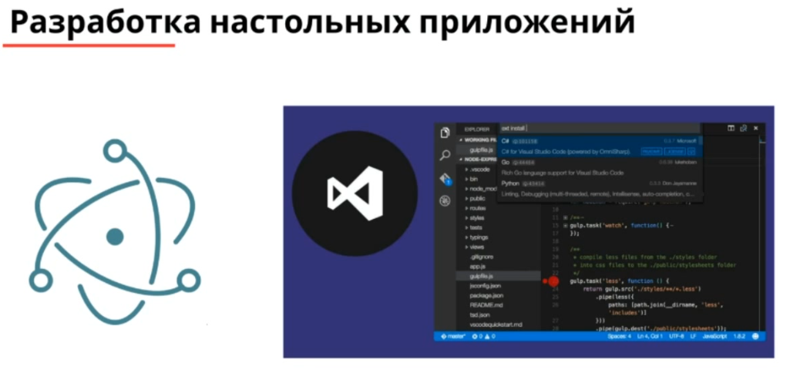
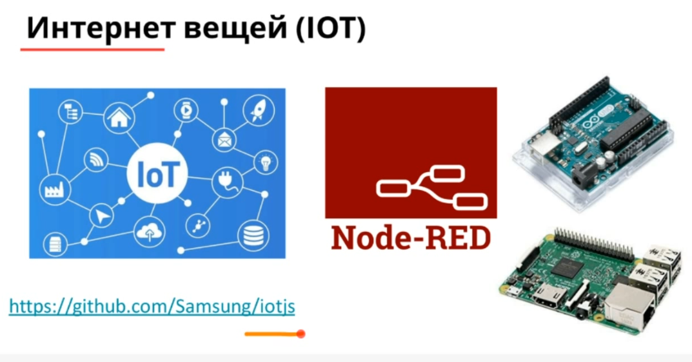

# Node.js серверный JavaScript

Содержание:

* [Теория Node.js](#NodeTheory)
    * [Архитектура Node.js](#architectoryNode)
    * [Как функционирует Node.js](#howDoesNodeWorks)
    * [Почему же выбирают Node.js?](#WhyDoWeChooseNode)
    * [Примеры использования Node.js](#NodeExamples)
    * [Для чего мы используем Node.js](#WhatAreYouUsingNodeFor)
* [Рабочее окружение и веб-разработка с использованием Node.js](#WorkEnvironment)
    * [Системы построения фронтенда](#NodeInFront)
    * [Фреймоврки](#Frameworks)
    * [Базы данных](#DB)
    * [Вне веб-разработки](#OutsideWeb)
* [Упраженения и теория детально](#examples)
    * [Модули](#Modules)
    * [Как работает Node?](#HowItWorksInDetail)
    * [События](#NodeEvents)
    * [Работа с файлами](#workWithFiles)

## Теория Node.js <a name="NodeTheory"></a>

Версии Node.js


Патч-версия - фиксирование багов.

Минорная версия - кроме фиксирования багов, обновление функционала (могут добавляться апи функции, переписываться внутреняя
реализация чего-то и тд), но минорная версия всегда подразумевает под собой совместимость с предыдущей версией.

Мажорная версия - полное переделывание вашего интерфейса, добавление функционала, запрещение какого-то функционала, 
добавление / удаление каких-то функций в коде и тд, обычно явная переделка.

Пример простейшего Hello World на ноде, создание сервера:



Сама нода, она асинхронна. Обработку всех событий, которые происходят (обращения к серверу и тд), всегда будет выполняться
через колбэк или промисы. 

### Архитектура Node.js <a name="architectoryNode"></a>


Глубоко внутри, у нас находятся модули на C++ (Node.js Bindings (привязки)), есть ядро библиотеки, написанное на JS,
есть библиотека libuv на языке С, которая отвечает за кросс-платформенные асинхронные запросы ввода/вывода для работы с 
файлами (потому что они разные под маком, под юниксом, под виндос), ну и, конечно, основа - движок V8. 

### Как функционирует Node.js <a name="howDoesNodeWorks"></a>



Нода сама по себе однопоточна. Есть свои преимущества посравнению с многопоточностью. У нее есть так называемый один поток
Event Loop, где она постоянно проводит опросы (приходит от пользователя request, мы их опрашиваем, на операции назначаем
обработчики и делегируем нашей библиотеке libuv (non-blocking Input/output), мы туда их перебрасываем и получается мы постоянно
работаем и не останавливаемся, нет никаких блокирующих операций (ждем пока база данных ответит, файловая система и тд, что-то из
них ответит и вернет нам назад ответ, как только он возвращается назад, мы пользователю возвращаем результат).)
 
Про недостаток ноды говорят, что она одноядерная и если у нас есть четырех-ядерный сервер, то Node всегда занимает одно ядро.
Поэтому внутри есть модуль-кластерс, который позволяет одно наше приложение распараллелить на четыре этих ядра. Мы можем
сделать так, что у нас одновременно работает четыре наших приложения, а пользователь когда заправляет Request даже не
не знает на какое приложение Event Loop он попал.   

Сама схема работы Ноды, использует за основу шаблон Реактор



Шаблон Реактор сам по себе работает в таком плане: 



* В самом вверху нас есть приложение, так же есть какие-то запросы Ввода/Вывода и затем мы какую-то операцию Ввода/Вывода
отправляем в Демультиплексор событий
* Демультиплексор событий - это в операционной системе (за нее отвечает libuv библиотека, которая как мы раньше говорили
кросс-платформенная, под юниксом она например эмулирует асихонронность), она выделяет какой-то ресурс, операцию и обработчик.
Обработчик - это как раз наша колбэк функция, которая должна выполнится после того как операция закончится. Т.е
мы отправляем демультиплексору событий запрос и ждем, когда он нам что-то там ответи, он  выполняет операцию, наше приложение
продолжает работать (мы как бы отправили запрос и сразу вернулись в приложение (пунктирная линия на картинке)), после того
как мы завершим, мы генерируем событие, что мы закончили работу с ресурсом каким-то (базой данных, файловых системой и тд)
и помещаем в очередь событий на (2) операции наш обработчик. 
* Затем на операции (3), пока наш цикл событий постоянно что-то опрашивает, происходит обход элементов в очереди событий, для
каждого события вызывается обработчик (4), после того как обработчик возвращает после обработки, он возвращает управление
циклу событий (5а), но ситуации бывают разные, мы можем внутри нашего обработчика вызвать еще раз асинхронную операцию (5б)
и все пойдет снова по нашей схеме.
* В цикле события Node все время что-то опрашивает. После того как Цикл событий произошел (6) переходит на демультиплексор
событий, он выполняется и снова по схеме с пункта (2)

### Почему же выбирают Node.js? <a name="WhyDoWeChooseNode"></a>


Ответы разработчиков Node.js:

* Node.js очкень эффективен, позволяя мне быть очень продуктивным
* Легкая разработка в enterprise, плюс 400 тыс. npm packages.
* Front-end, back-end и тестер имеют одинаковый язык для работы.
* Я могу развиваться и быть продуктивным во всех стеках без необходимости манирулировать другим снитаксисом.
* Тот же язык на клиенте и сервер; js способствует функциональному программированию; Typescript хорошо работает с Node.js.
* Скорость, доступность, набор инструментов. Прекрасный, как глоток свежего воздуха по сравнению с php.
* Так легко писать код в Node.js. Вы можете читать его, как любой человеческий язык.

### Примеры использования Node.js <a name="NodeExamples"></a>

* Чат (https://socket.io/)
* REST API - (http://restify.com/)
* Работа с высоконагруженными БД (MongoDB, Redis)
* Мониторинг - например отслеживание посетителей сайта и визуализация их взаимодействия в режиме реального времени
* Почти любая обработка данных в реальном времени
* Node.js с Express.js также можно использовать для создания классических веб-приложений на стороне сервера

### Для чего мы используем Node.js <a name="WhatAreYouUsingNodeFor"></a>


## Рабочее окружение и веб-разработка с использование Node.js <a name="WorkEnvironment"></a>

### Системы построения фронтенда <a name="NodeInFront"></a>



### Фреймоврки <a name="Frameworks"></a>


### Базы данных <a name="DB"></a>



### Варианты развертывания Node.js <a name="DB"></a>


### Вне веб-разработки <a name="OutsideWeb"></a>








## Упраженения и теория детально <a name="examples"></a>

Для примера запишем некий код в файл с именем script.js:

```javascript
var text = 'Hello student!!'
console.log(text);
```

И запустим его из консоли в той директории, где он был создан, следующей командой

```
node script.js
```

В консоли должна появиться надпись:

    Hello student!
    
### Модули <a name="Modules"></a>

Для подключения к вашим скриптам дополнительных функций в Node.js существует удобная система управления модулями NPM. По
сути это публичный репозиторий созданных при помощи Node.js дополнительных программных модулей.

Команда npm позволяет легко устанавливать, удалять или обновлять нужные вам модули, автоматически учитывая при этом все
зависимости выбранного вами подуля от других.

Установка пмодуля производится командой:

    npm install *имя модуля* [*ключи*]
    
Для установки модуля будет использована поддиректория node_modules.

Хотя node_modules и содержит все необходимые для запуска зависимости, распространять исходные код вместе с ней не принято,
т.к. в ней может храниться большое количество файлов, которые занимают ощутимый объем и это неудобно.

С учетом того, что все публичные NPM - модули можно легко установить с помощью npm, достаточно создать и написать для 
вашей программы файл package.json с перечнем всех необходимых для работы зависимостей потом просто, на новом месте, например,
установить все нужные модули командой:

    npm install
    
Node.js работает с системой подключения модулей CommonJS. В структурном плане, CommonJS-модуль представляет собой готовый
к новому использованию фрагмент JavaScript-кода, который экспортирует специальные объекты, доступные для использования в любом
зависимом коде. CommonJS используется как формат JavaScript-модулей, так же и на front-end. Две гланвых идеи CommonJS-модулей:
**объект exports**, содержащий то, что модуль хочет сделать доступным для других частей системы, и **функцию require**,
которая используется одними модулями импорта объекта exports из других.

Начиная с версии 6.х Node.js так же поддерживает подключение модулей согласно стандарту ECMAScript-2015.

Давайте попробуем что-нибдуь подключить. Например, модуль <a href="https://www.npmjs.com/package/colors">Colors</a> для
предыдущего скрипта, и немного перепишем его. Наш скрипт станет выглядеть так:

```javascript
var colors = require('colors');
var text = 'Hello studen!';
console.log(text.rainbow);
```

Выполним команды в консоли:

    npm install colors
    node script.js
    
Увидим разноцветный текст.


### Как работает Node? <a name="HowItWorksInDetail"></a>

В основе Node лежит библиотека **libuv**, реализующая цикл событий **event loop**.

Мы знаем, что объявленная переменная в скрипте автоматически станвоится глобальной. В Node она остается локальной для текущего
модуля и чтобы сделать ее глобальной, надо объявить ее как свойство объекта Global:

    global.foo = 3;
    
Фактически, объект Global - это аналог объекта window из браузера.

Метод **require**, служащий для подключения модулей, не является глобальным и локален для каждого модуля.

Также локальными для каждого модуля являются:

* module.export - объект, отвечающий за то, что именно будет экспортировать модуль при использовании require;

* _filename - имя файла исполняемого скрипта;

* _dirname - абсолютный путь до исполняемого скрипта.

В секцию Global входят такие важные элементы как:

* Class: Buffer - объект используется для операций с бинарными данными.

* Process - объект процесса, большая часть данных находится именно здесь.

Приведем пример работы некоторых из них. Назначение понятно из названий:

    console.log(process.execPath);  // e:\Program Files\nodejs\node.exe
    console.log(process.version);  // v10.5.0
    console.log(process.platform); // win32
    console.log(process.arch);  // ia32
    console.log(process.title);
    console.log(process.pid);

Свойство **process.argv** содержит массив аргументов командной строки. Первым аргументом будет имя исполняемого приложения
node, вторым имя самого исполняемого сценария и только потом сами параметры.

Для работы с каталогами есть следующие свойства - process.cwd() возвращает текущий рабочий каталог, **process.chdir()**
выполняет переход в другой каталог.

Команда **process.exit()** завершает процесс с указанным в качестве аргумента кодом: 0 - успешный код, 1 - код с ошибкой.

Важный метод process.nextTick(fn) запланирует выполнение указанной функции таким образом, что указанная функция будет
выполнена после окончания текущей фазы (текущего исполняемого кода), но перед началом следующей фазы eventloop.

    process.nextTick(function()  {
    console.log('NextTick callback');
    }
    
Объект Process содержит еще много свойств и методов, с которыми можно ознакомиться в
<a href="https://nodejs.org/dist/latest-v4.x/docs/api/process.html">справке</a>.

### События <a name="NodeEvents"></a>

За события в Node.js отвечает специальный модуль **events**.

Назначать объекту обработчик события следует методом addListener(event, listener). Аргументы - это имя события event,
в camelCase формате и listener - функция обратного вызова, обработчик события. Для этого метода есть более короткая запись
**on()**.

Удалить обработчик можно методом **removeListener(event, listener)**.

А метод **emit(event, [args])** позволяет события срабатывать.

Например, событие 'exit' отправляется перед завершением работы Node.

    process.on('exit', function() {
        console.log('Bye!');
    });
    

### Работа с файлами <a name="workWithFiles"></a>

Модуль FileSystem отвечает за работу с файлами. Инициализация модуля происходит следующим образом:


